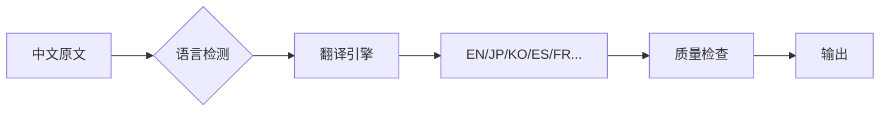

# 墨海 · 出海本地化引擎

## 概述

**墨海** 是赫墨斯 OS 的出海本地化引擎。**不依赖任何新的外部项目**——墨海整合 Hermes 现有能力（翻译、发布、SEO、文案、视频、法务）为完整的出海工作流：从中文内容到多语言发布、SEO 优化、视频字幕、合规检查的一站式管线。

### 核心管线

```
中文内容 → 多语言翻译 → SEO优化 → 平台适配 → 同步发布 → 合规检查
                    ↓
              视频本地化 (字幕/TTS)
                    ↓
              多语言文案优化
```

---

## 何时使用

- 用户说："帮我把这篇内容翻译成英文/日语/韩语"
- 用户说："在 Reddit/Twitter/LinkedIn 上发帖"
- 用户说："优化一下这篇英文内容的 SEO"
- 用户说："给这个视频加上英文字幕"
- 用户说："检查一下我们的跨境法律合规"
- 用户说："帮我写一个英文版的营销文案"
- 用户说："把这篇小红书笔记翻译成英文发到 X (Twitter)"

---

## 1. 内容翻译（Hermes 语言能力）

墨海利用 Hermes 的 LLM 语言能力进行高质量多语言翻译，无需调用外部翻译 API。

### 翻译流程



### 翻译质量框架

```yaml
translation_pipeline:
  source_language: "zh-CN"
  target_languages:
    - "en-US"    # 英语（美式）
    - "ja-JP"    # 日语
    - "ko-KR"    # 韩语
    - "es-ES"    # 西班牙语
    - "fr-FR"    # 法语
    - "de-DE"    # 德语
    - "pt-BR"    # 葡萄牙语（巴西）
    - "vi-VN"    # 越南语
    - "th-TH"    # 泰语
  
  content_types:
    social_media:               # 社媒帖文
      style: "casual, engaging"
      max_length: 280           # Twitter 字符限制
      hashtag_handling: "translate + localize"
    
    marketing_copy:             # 营销文案
      style: "persuasive, brand-aligned"
      preserve: ["brand_names", "slogans", "key_metrics"]
    
    product_description:        # 产品描述
      style: "clear, conversion-focused"
      preserve: ["specs", "prices", "measurements"]
    
    video_subtitle:             # 视频字幕
      style: "concise, timed"
      max_chars_per_line: 42
      timing_sensitive: true
    
    legal_compliance:           # 合规文件
      style: "precise, legally accurate"
      preserve: ["legal_terms", "clause_numbers"]
      require_review: true
```

### 翻译质量检查清单

- [ ] 术语一致性：品牌词、产品名、专业术语保持统一
- [ ] 文化适配：俚语、习语、emoji 本地化替换
- [ ] 格式保留：Markdown 结构、换行、列表格式
- [ ] 数字格式：日期(MM/DD vs DD/MM)、货币、度量单位转换
- [ ] 长度适配：翻译后文本长度是否在目标平台限制内
- [ ] SEO关键词：目标语言的关键词自然融入（参考 seo-machine）

### 文化适配参考

| 中文元素 | 英文适配 | 日文适配 | 说明 |
|---------|---------|---------|------|
| "亲" / "宝" | "Hey there" / 省略 | "お客様" | 中文亲切称呼在英文中可能显得过于亲密 |
| "666" / "牛" | "Awesome!" / "Nice!" | "すごい！" | 中国网络用语需要本地化 |
| "红包" | "Bonus" / "Reward" | "ボーナス" | 直译 "red packet" 可能让人困惑 |
| 价格 ¥99 | $13.99 / €12.99 | ¥1,980 | 按当地市场定价，非简单汇率转换 |
| 日期格式 | MM/DD/YYYY | YYYY年MM月DD日 | 目标地区格式 |

---

## 2. 海外平台发布（social-push-publisher + send_message）

墨海集成 `social-push-publisher` skill 实现海外社媒平台自动化发布。

### 支持的海外平台

| 平台 | 发布方式 | 内容类型 | 字符限制 |
|------|---------|---------|---------|
| **X (Twitter)** | `social-push-publisher` + `send_message` | 短帖文 | 280 字符 |
| **Reddit** | `send_message` + API | 帖子 + 评论 | 10000 字符 |
| **LinkedIn** | `send_message` + API | 文章 / 帖子 | 3000 字符 |
| **Medium** | `social-push-publisher` | 长文章 | 不限 |
| **YouTube** | `social-push-publisher` | 视频 + 描述 | 5000 字符 |

### 发布工作流

```
1. 内容准备 → 翻译 → SEO优化 → 平台格式适配
2. 选择发布平台（可多选）
3. 平台特定适配：
   - Twitter: 短文案 + 话题标签 + 图片
   - Reddit: 标题 + 正文 + subreddit 选择
   - LinkedIn: 专业风格 + 行业标签
4. social-push-publisher → 保存为草稿
5. 用户审核确认后发布
```

### 平台发布模板

```yaml
platform_templates:
  twitter:
    format: |
      {headline}
      
      {body_short} (max 180 chars)
      
      {link}
      {hashtags}
    
    best_practices:
      - 前 4 个字符要抓眼球（用户浏览时只看开头）
      - 每条推文只放 1 个链接
      - 使用 2-3 个相关话题标签
      - 附一张配图（图片互动率高 150%）
    
    schedule:
      best_times: ["8:00-9:00 EST", "12:00-13:00 EST", "17:00-18:00 EST"]
      frequency: "2-3 条/天"

  reddit:
    format: |
      ## {title} (max 300 chars)
      
      {body}
      
      ---
      *{disclaimer}*
    
    best_practices:
      - 标题要有争议性或引发讨论
      - 不要过度营销——Reddit 用户反感
      - 选择正确的 subreddit（子版块）
      - 发布后积极参与评论回复
      - 阅读 subreddit 版规，避免被封禁

  linkedin:
    format: |
      {attention_grabbing_opener}
      
      {body_with_line_breaks}
      
      {call_to_action}
      
      #{hashtags}
    
    best_practices:
      - 专业但不沉闷
      - 个人经验分享 > 公司宣传
      - 使用 bullet points 提高可读性
      - 附图片/文档/链接
```

---

## 3. SEO 优化（seo-machine）

墨海集成 `seo-machine` skill 对翻译后的内容进行目标语言 SEO 优化。

### 多语言 SEO 工作流

```
翻译后内容
  ↓
目标语言关键词研究（seo-machine: 关键词聚类 + 搜索意图）
  ↓
内容结构优化（H1/H2/H3 含目标关键词）
  ↓
品质评分（seo-machine: 0-100 评分）
  ↓
内链策略（关联英文/日文等已有内容）
  ↓
SEO 就绪内容
```

### 多语言 SEO 关键点

| SEO 要素 | 中文 → 英文注意事项 |
|---------|-------------------|
| **关键词** | 不要直译中文关键词，用 seo-machine 做英文关键词研究 |
| **标题 (H1)** | 英文标题 50-60 字符，核心关键词靠前 |
| **元描述** | 150-160 字符，含 CTA，区别于翻译版本 |
| **URL Slug** | 英文化、短、含关键词（用连字符） |
| **H2/H3** | 英文搜索引擎偏好问题式标题（How to / What is） |
| **内容长度** | 英文 SEO 内容通常需要 1500-2500 字（比中文长） |
| **Schema 标记** | 英文内容支持更多 Schema 类型（FAQPage, HowTo, Product） |
| **hreflang 标签** | 如果有多个语言版本，需添加 `<link rel="alternate" hreflang="en" href="...">` |

### 多语言内容质量评分

使用 `seo-machine` 的 quality_scoring 框架，用目标语言评估：

```yaml
# 对英文版内容的评分标准示例
quality_checklist:
  on_page_seo (30pts):
    - title_tag_optimization: 5
    - meta_description: 5
    - heading_structure: 5
    - url_structure: 5
    - image_alt_text: 5
    - keyword_placement: 5
  
  content_quality (40pts):
    - search_intent_match: 10  # 英文搜索意图 ≠ 中文搜索意图
    - comprehensiveness: 10    # 英文读者期望更详细
    - originality: 8
    - readability: 6           # 英文 8 年级阅读水平
    - freshness: 6
  
  technical_seo (15pts):
    - schema_markup: 5
    - mobile_friendly: 5
    - page_speed: 5
  
  international_seo (15pts):
    - hreflang_tags: 5
    - geo_targeting: 5
    - cultural_relevance: 5
```

---

## 4. 多语言文案优化（marketing-skills-copywriting）

墨海集成 `marketing-skills-copywriting` skill 对翻译后的营销内容进行目标语言文案优化。

### 跨文化文案适配

| 中文文案框架 | 英文等效框架 | 说明 |
|------------|-------------|------|
| **痛点共鸣** → "你是否也..." | **PAS** (Problem-Agitate-Solve) | 英文用户更习惯结构化说服 |
| **权威背书** → "某某专家推荐" | **Social Proof** → "Join 10,000+ users" | 英文更注重数量化的社会证明 |
| **紧迫感** → "限时优惠，手慢无" | **FOMO** → "Limited offer — expires in 24h" | 英文需要具体数字制造紧迫感 |
| **情感营销** | **Storytelling** → "I started with $100 and..." | 英文用户更吃个人故事 |

### 文案适配工作流

```
翻译稿 → 文案框架适配（AIDA/PAS/4P）
  → 情感触发词本地化
  → Call-to-Action 优化
  → A/B 测试草稿生成
  → 最终输出
```

### 平台特定文案风格

| 平台 | 风格 | 长度 | CTA 示例 |
|------|------|------|---------|
| **X (Twitter)** | 简洁有力 | 280字 | "Learn more →" / "Join the waitlist" |
| **LinkedIn** | 专业有洞察 | 200-500字 | "What's your take? Share below ↓" |
| **Reddit** | 真实有料 | 500-2000字 | "AMA" / "What do you think?" |
| **Medium** | 深度叙述 | 1000-4000字 | "Follow for more" / "Clap 👏 if..." |

---

## 5. 视频本地化（ffmpeg-video-engine）

墨海集成 `ffmpeg-video-engine` skill 对视频内容进行本地化处理——字幕翻译、配音替换、本地化图片生成。

### 视频本地化管线

```
原始视频 (中文)
  ↓
Step 1: 音频转文字 (ASR) / 获取原有字幕
  ↓
Step 2: 字幕翻译（墨海翻译引擎）
  ↓
Step 3: 硬编码字幕（ffmpeg drawtext）
  ↓
Step 4: TTS 配音替换（edge-tts 英文/日语等语音）
  ↓
Step 5: 视频封面文字本地化
  ↓
本地化视频输出
```

### 字幕本地化命令

```bash
# 硬编码英文字幕到视频
ffmpeg -i input.mp4 \
  -vf "drawtext=text='Subtitle text here':fontcolor=white:fontsize=36:\
       x=(w-text_w)/2:y=h-th-80:box=1:boxcolor=black@0.5:boxborderw=8" \
  -c:a copy output_en.mp4

# 使用字幕文件（SRT/ASS）
ffmpeg -i input.mp4 -vf "subtitles=subtitles_en.srt" output_en.mp4
```

### TTS 配音替换（多语言）

```bash
# 英文配音
edge-tts --voice en-US-JennyNeural \
  --text "Hello, welcome to our tutorial..." \
  --write-media output_en.mp3

# 日语配音
edge-tts --voice ja-JP-NanamiNeural \
  --text "こんにちは、私たちのチュートリアルへようこそ..." \
  --write-media output_jp.mp3

# 韩语配音
edge-tts --voice ko-KR-SunHiNeural \
  --text "안녕하세요, 튜토리얼에 오신 것을 환영합니다..." \
  --write-media output_ko.mp3
```

### 平台视频规格

| 平台 | 分辨率 | 字幕格式 | 时长推荐 | 封面文字 |
|------|--------|---------|---------|---------|
| **YouTube** | 1920×1080 (16:9) | SRT/ASS | 5-15分钟 | 英文标题 + 缩略图 |
| **X (Twitter)** | 1080×1920 (9:16) | 硬编码 | 30-60秒 | 大字 + 品牌颜色 |
| **LinkedIn** | 1080×1080 (1:1) | 硬编码 | 2-5分钟 | 专业风格标题 |
| **TikTok** | 1080×1920 (9:16) | 硬编码 | 15-60秒 | 动态标题 + emoji |

---

## 6. 跨境合规检查（molin-legal）

墨海集成 `molin-legal` skill 对出海内容进行跨境法律合规检查。

### 合规检查范围

```yaml
compliance_checks:
  gdpr:                    # 通用数据保护条例（欧盟）
    applicable: true       # 面向欧盟用户时启用
    checks:
      - "隐私政策是否包含 GDPR 要求的 14 项内容"
      - "Cookie 同意机制是否存在"
      - "数据处理说明是否清晰"
      - "用户数据删除/导出流程是否说明"
  
  ccpa:                    # 加州消费者隐私法案（美国）
    applicable: true       # 面向加州用户时启用
    checks:
      - "隐私政策是否包含 CCPA 要求的 10 项内容"
      - "Opt-out 机制是否说明"
      - "数据售卖声明是否存在"
  
  platform_tos:            # 各平台服务条款
    checks:
      - "Reddit: 禁止过度营销、自我推广比例 <10%"
      - "Twitter: 禁止垃圾内容、重复发布"
      - "LinkedIn: 禁止虚假资料、自动化操作"
      - "YouTube: 版权声明、广告披露"
  
  content_disclaimer:      # 内容声明
    checks:
      - "AI 生成内容是否需标明（部分平台要求）"
      - "赞助/广告内容是否标注 #ad #sponsored"
      - "产品声明（如非医疗建议、非投资建议）"
  
  cross_border_data:       # 数据跨境
    checks:
      - "用户数据存储位置是否符合当地法规"
      - "数据传输是否有合法依据（SCC/Binding Corporate Rules）"
```

### 出海合规工作流

```
内容（翻译后）
  ↓
识别目标市场（EU/US/JP/KR...）
  ↓
选择适用的法规框架（GDPR/CCPA/APPI/...）
  ↓
逐项合规检查
  ↓
标记不合规项 + 修改建议
  ↓
输出合规报告
```

### 合规声明模板

```markdown
# 内容合规声明

**内容类型**: 社交媒体帖文 / 视频 / 文章
**目标市场**: 🇺🇸 美国 / 🇪🇺 欧盟 / 🇯🇵 日本
**发布平台**: Twitter / Reddit / LinkedIn

## 合规检查结果

| 检查项 | 状态 | 说明 |
|--------|:----:|------|
| GDPR 隐私要求 | ✅ Pass | 不涉及个人数据收集 |
| CCPA 要求 | ✅ Pass | 不涉及数据售卖 |
| 广告披露 | ⚠️ Warning | 需添加 #ad 标签 |
| 版权检查 | ✅ Pass | 使用原创/授权内容 |
| 平台 TOS | ✅ Pass | 符合各平台条款 |

**备注**: 建议在帖文末尾添加 `#ad` 或 `#sponsored` 标签以符合 FTC 广告披露要求。
```

### 各平台合规速查

| 平台 | 关键要求 | 常见违规 |
|------|---------|---------|
| **Reddit** | 发帖前阅读 subreddit 版规；自推广比例 <10%；禁止操控投票 | 过度推广、发帖频率过高、无视版规 |
| **X (Twitter)** | 禁止垃圾内容、重复内容、虚假互动；AI 生成内容需标注 | 大量 @ 用户、重复相同内容、机器人行为 |
| **LinkedIn** | 真实身份、禁止自动化操作、禁止虚假资料 | 大量加好友、自动消息、虚假职位 |
| **YouTube** | 版权声明、广告披露（#paidpromotion）、社区准则 | 未授权音乐/视频、误导性标题、不当内容 |

---

## 完整端到端工作流

### 场景：中文产品推文 → 多语言多平台发布

```
1. 输入：中文产品推文草稿
   "我们的AI写作工具终于上线了！支持30+语言，一键生成高质量文案。现在注册享7天免费试用！🚀"

2. 墨海翻译引擎 → 英文/日文/韩文版本
   EN: "Our AI writing tool is finally live! Supports 30+ languages, one-click high-quality copy generation. Sign up now for a 7-day free trial! 🚀"
   JP: "AIライティングツールがついにリリース！30+言語対応、ワンクリックで高品質なコピーを生成。今すぐ登録で7日間無料トライアル！🚀"
   KO: "AI 작문 도구가 드디어 출시되었습니다! 30개 이상 언어 지원, 원클릭 고품질 카피 생성. 지금 가입하시면 7일 무료 체험! 🚀"

3. SEO 优化 (seo-machine)：
   - 研究英文关键词: "AI writing tool", "free trial", "content generator"
   - 优化 H1/描述含核心关键词
   - 品质评分: 86/100

4. 文案优化 (marketing-skills-copywriting)：
   - 英文版用 PAS 框架重写
   - 日文版添加敬语和礼貌表达
   - 韩文版调整语气更直接

5. 平台适配：
   - Twitter: 缩短至 280 字符 + 话题标签
   - LinkedIn: 扩展为 300 字专业帖文
   - Reddit: 改写为讨论式标题，发布到 r/SaaS

6. 合规检查 (molin-legal)：
   - "Free trial" 声明是否清晰
   - 是否需要添加 #ad 标签
   - 各平台 TOS 合规

7. 发布 (social-push-publisher)：
   - 各平台保存为草稿
   - 用户审核确认
   - 定时发布（各平台最佳时间）
```

---

## 验证清单

- [ ] 翻译流程可运行（中→英/日/韩至少三种语言）
- [ ] 文化适配规则已定义（习语、emoji、日期格式）
- [ ] 至少一个海外平台发布流程已验证（Twitter/Reddit/LinkedIn）
- [ ] SEO 优化流程可执行（seo-machine 关键词研究 + 评分）
- [ ] 文案优化流程可执行（marketing-skills-copywriting 框架）
- [ ] 视频字幕本地化流程可运行（ffmpeg-video-engine）
- [ ] 跨境合规检查流程可执行（molin-legal GDPR/CCPA/平台 TOS）
- [ ] 端到端出海管线可完整执行
- [ ] 各平台发布模板已预配置

---

## 最佳实践

1. **翻译 ≠ 本地化**: 好的出海内容需要重写，不只是翻译
2. **SEO 从目标语言开始**: 不要翻译中文关键词，用 seo-machine 做英文关键词研究
3. **各平台独立运营**: 同一内容不同平台需要不同调性，不要一键复制粘贴
4. **合规先行**: 发布前做合规检查，避免账号被封或法律纠纷
5. **视频是超车道**: 出海视频（带英文字幕）比纯文字内容的 ROI 高 3-5 倍
6. **保持品牌一致**: 多语言多平台发布时，保持品牌声音和视觉的一致性
7. **文化敏感**: 检查目标市场的文化禁忌（颜色、符号、手势等）